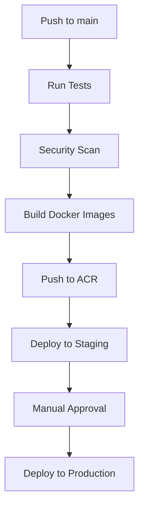

# Azure Deployment Guide 🚀

This directory contains all the necessary files and scripts to deploy the FYP Stock Analyzer to Azure using Infrastructure as Code (IaC) and automated CI/CD pipelines.

## 📁 Files Overview

```
azure/
├── setup.ps1                 # PowerShell setup script (Windows)
├── setup.sh                  # Bash setup script (Linux/Mac)
├── container-registry.json   # ARM template for Azure Container Registry
├── container-instances.json  # ARM template for Azure Container Instances
└── README.md                 # This file
```

## 🎯 Quick Start

### Prerequisites
- Azure CLI installed and configured
- Azure subscription with student credits
- GitHub repository access
- PowerShell (Windows) or Bash (Linux/Mac)

### Step 1: Run Setup Script

**Windows (PowerShell):**
```powershell
.\azure\setup.ps1
```

**Linux/Mac (Bash):**
```bash
chmod +x azure/setup.sh
./azure/setup.sh
```

### Step 2: Configure GitHub Secrets

The setup script will output GitHub secrets. Add these to your repository:
1. Go to your GitHub repository
2. Navigate to **Settings** → **Secrets and variables** → **Actions**
3. Click **New repository secret**
4. Add each secret from the script output:

| Secret Name | Description |
|-------------|-------------|
| `AZURE_CREDENTIALS` | Service principal credentials for Azure login |
| `AZURE_RESOURCE_GROUP` | Resource group name |
| `AZURE_REGISTRY_USERNAME` | ACR username |
| `AZURE_REGISTRY_PASSWORD` | ACR password |
| `STAGING_DATABASE_URL` | MongoDB connection string for staging |
| `PRODUCTION_DATABASE_URL` | MongoDB connection string for production |

### Step 3: Deploy

Push code to the `main` branch to trigger automatic deployment:

```bash
git add .
git commit -m "feat: Add Azure deployment configuration"
git push origin main
```

## 🏗️ Infrastructure Components

### Azure Container Registry (ACR)
- **Purpose**: Stores our Docker images securely
- **SKU**: Basic (cost-effective for student use)
- **Name**: `fypstockanalyzer.azurecr.io`

### Azure Container Instances (ACI)
- **Staging Environment**: 
  - Backend: 1 CPU, 2GB RAM
  - Frontend: 0.5 CPU, 1GB RAM
  - Auto-deployed on main branch pushes
  
- **Production Environment**:
  - Backend: 2 CPU, 4GB RAM  
  - Frontend: 0.5 CPU, 1GB RAM
  - Requires manual approval

### Container Group Architecture
```
┌─────────────────────────────────────────┐
│             Azure Container Group       │
├─────────────────────────────────────────┤
│ 🐍 Backend (FastAPI)     Port: 8000    │
│ ⚛️  Frontend (React)      Port: 80      │
│ 🍃 MongoDB               Port: 27017    │
│ 🤖 Ollama (LLM)          Port: 11434    │
└─────────────────────────────────────────┘
```

## 🔄 CI/CD Pipeline Flow



### Pipeline Stages

1. **🧪 Test**: Python tests, linting, security scans
2. **🛡️ Security**: TruffleHog secrets scan, dependency audits
3. **🐋 Build**: Docker image creation and testing
4. **📤 Push**: Upload images to Azure Container Registry
5. **🎭 Staging**: Automatic deployment to staging environment
6. **🌟 Production**: Manual approval required for production

## 🌐 Environment URLs

After deployment, your applications will be available at:

### Staging
- Backend: `http://fyp-backend-staging-{run-number}.eastus.azurecontainer.io:8000`
- Frontend: `http://fyp-backend-staging-{run-number}.eastus.azurecontainer.io`

### Production  
- Backend: `http://fyp-backend-prod.eastus.azurecontainer.io:8000`
- Frontend: `http://fyp-backend-prod.eastus.azurecontainer.io`

## 💰 Cost Estimation (Azure Student Credits)

| Component | Monthly Cost | Notes |
|-----------|--------------|-------|
| ACR Basic | ~$5/month | Includes 10GB storage |
| ACI Staging | ~$15/month | 1.5 CPU, 3GB RAM |
| ACI Production | ~$25/month | 2.5 CPU, 5GB RAM |
| **Total** | **~$45/month** | Well within student credit limits |

## 🔧 Troubleshooting

### Common Issues

**Authentication Errors:**
```bash
# Re-login to Azure
az login

# Verify subscription
az account show
```

**Container Registry Access:**
```bash
# Test ACR login
az acr login --name fypstockanalyzer

# List repositories
az acr repository list --name fypstockanalyzer --output table
```

**Container Deployment Issues:**
```bash
# Check container group status
az container show --resource-group fyp-stock-analyzer-rg --name fyp-backend-staging

# View logs
az container logs --resource-group fyp-stock-analyzer-rg --name fyp-backend-staging --container-name backend
```

### Useful Commands

```bash
# View all resources
az resource list --resource-group fyp-stock-analyzer-rg --output table

# Monitor container group
az container show --resource-group fyp-stock-analyzer-rg --name fyp-backend-staging --query instanceView.state

# Delete everything (careful!)
az group delete --name fyp-stock-analyzer-rg --yes --no-wait
```

## 🎓 Learning Objectives

This Azure deployment teaches you:

1. **Infrastructure as Code (IaC)**: Using ARM templates for reproducible infrastructure
2. **Container Orchestration**: Managing multi-container applications
3. **CI/CD Pipelines**: Automated testing, building, and deployment
4. **Cloud Security**: Proper secret management and access controls
5. **Environment Management**: Staging vs production deployment strategies
6. **Monitoring**: Container health checks and logging

## 🔄 Next Steps

1. **Custom Domains**: Set up custom domain names for your applications
2. **SSL Certificates**: Add HTTPS encryption
3. **Database Migration**: Move to Azure Cosmos DB for better scalability
4. **Load Balancing**: Add Azure Load Balancer for high availability
5. **Monitoring**: Implement Azure Application Insights

## 🆘 Support

If you encounter issues:
1. Check the GitHub Actions logs for detailed error messages
2. Verify all GitHub secrets are correctly set
3. Ensure Azure CLI is properly authenticated
4. Review Azure resource group in the portal for any failed deployments

---

**Happy Deploying! 🚀**